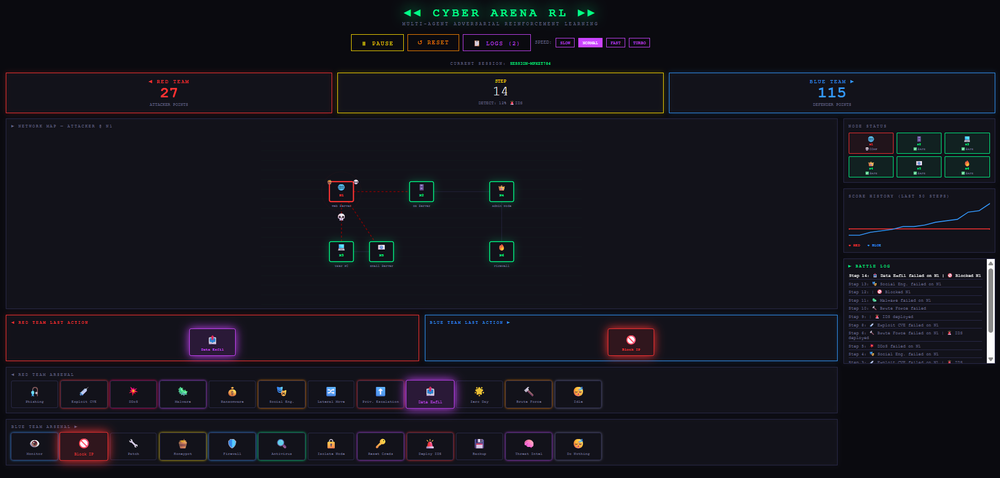
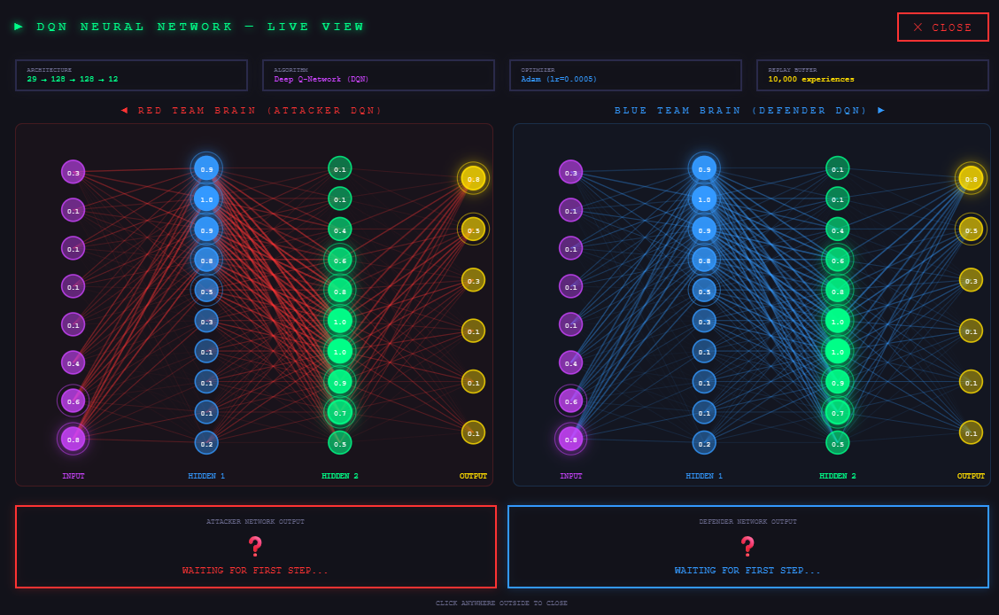
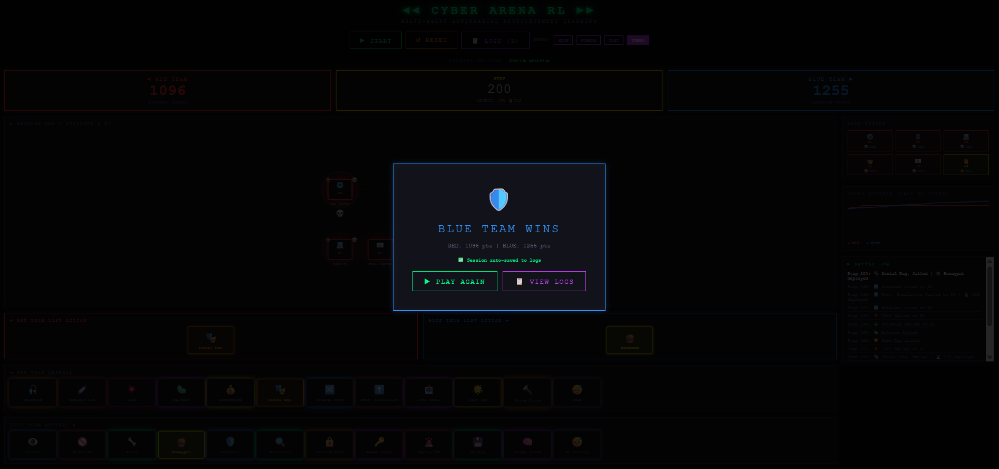
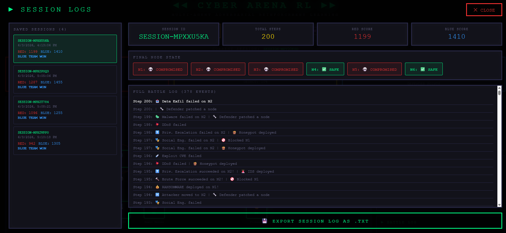
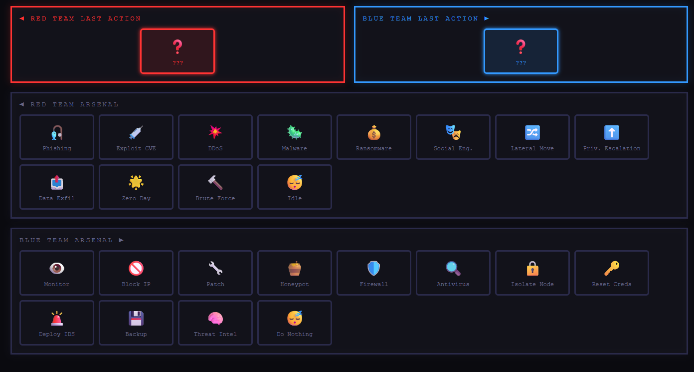
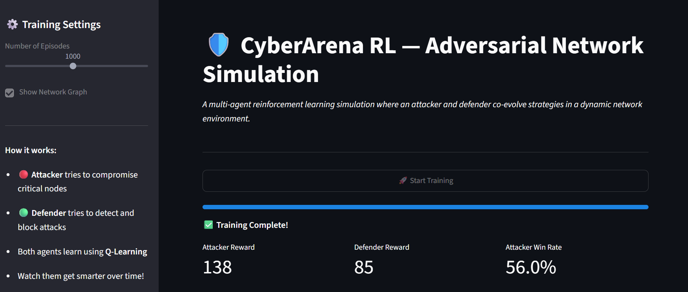
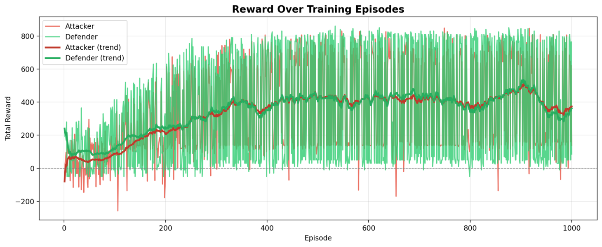
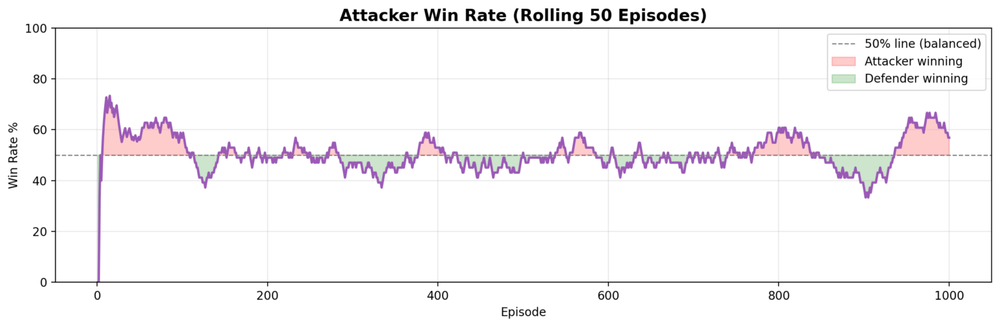
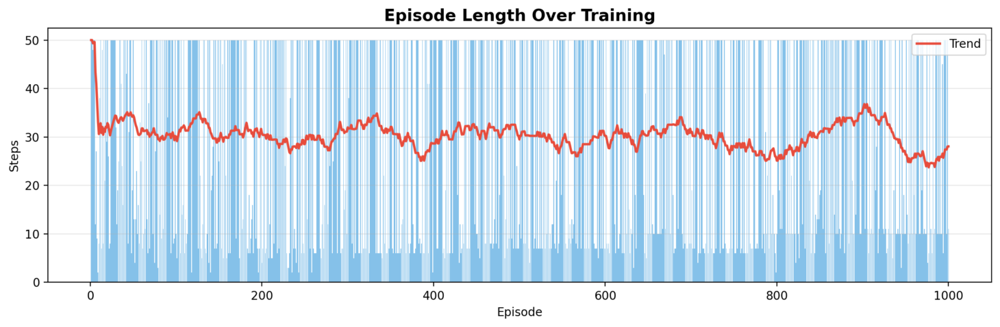
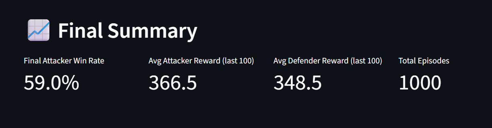

# 🛡️ CyberArena RL
### Multi-Agent Reinforcement Learning for Adversarial Cybersecurity Simulation

[](https://cyber-arena-delta.vercel.app/)
[](https://cyber-arena.streamlit.app/)
[](https://cyberarena-api.onrender.com/docs)
[](https://github.com/vansh-kumar-007)
[](https://www.linkedin.com/in/vanshkumar007/)


---

## 🎮 Live Battle Preview


> Two AI agents — one attacking, one defending — learning to outsmart each other
> in real time inside a pixel-art cyberpunk network simulation.

---

## 📌 Overview

CyberArena RL is a **full-stack multi-agent reinforcement learning simulation** that 
models an adversarial cybersecurity environment where an attacker (Red Team 🔴) and 
a defender (Blue Team 🔵) continuously adapt their strategies using **Deep Q-Networks**.

Both agents learn purely through interaction — no rules, no hardcoding. Complex 
behaviors emerge naturally over thousands of episodes. The entire system is deployed 
live with a **React pixel-art game frontend**, **FastAPI backend**, and 
**Streamlit analytics dashboard**.

> "A simulated cyber battlefield where AI attackers and AI defenders learn,
> adapt, and evolve against each other — powered by real neural networks."

---

## 🚀 Try It Live

| Interface | Link | Description |
|-----------|------|-------------|
| 🎮 Pixel Art Game | [Play Now](https://cyber-arena-delta.vercel.app/) | Live battle with real DQN |
| 📊 Streamlit Dashboard | [Open Dashboard](https://cyber-arena.streamlit.app/) | Training analytics |
| ⚡ API Documentation | [FastAPI Docs](https://cyberarena-api.onrender.com/docs) | REST API endpoints |

---

## 🖥️ Screenshots

### Live Battle


### Neural Network Live View


### Winner Screen


### Session Logs


### Attack & Defense Arsenal


### Streamlit Training Dashboard


---

## 🎯 Why This Project Matters

Cybersecurity is fundamentally an adversarial problem — attackers find new paths
while defenders update their strategies. CyberArena RL explores autonomous learning:

- ✅ Autonomous attacker learning via Deep Q-Network
- ✅ Autonomous defender learning via Deep Q-Network
- ✅ Dynamic strategy co-evolution
- ✅ Emergent behavior from interaction
- ✅ Real neural networks powering live gameplay
- ✅ Full-stack deployment with REST API

---

## 🏗️ System Architecture

```text
┌─────────────────────────────────────────────────────────────────┐
│                        CYBER ARENA RL                           │
│                                                                 │
│   ┌─────────────────────────────────────────────────────────┐  │
│   │              React Frontend (Vercel)                    │  │
│   │  Pixel Art Game │ Neural Net Viz │ Logs │ Scoreboard    │  │
│   └───────────────────────┬─────────────────────────────────┘  │
│                           │ HTTP REST                           │
│   ┌───────────────────────▼─────────────────────────────────┐  │
│   │              FastAPI Backend (Render)                   │  │
│   │     /reset  │  /step  │  /weights  │  /status          │  │
│   └───────────────────────┬─────────────────────────────────┘  │
│                           │                                     │
│   ┌───────────────────────▼─────────────────────────────────┐  │
│   │              Python RL Engine                           │  │
│   │                                                         │  │
│   │   ┌──────────────┐         ┌──────────────────────┐    │  │
│   │   │ DQN Attacker │────────►│  Network Environment  │    │  │
│   │   │ 37→128→128→12│         │  6 Nodes             │    │  │
│   │   └──────────────┘         │  12 Attack Types      │    │  │
│   │   ┌──────────────┐         │  12 Defense Types     │    │  │
│   │   │ DQN Defender │────────►│  Reward System        │    │  │
│   │   │ 29→128→128→12│         └──────────────────────┘    │  │
│   │   └──────────────┘                                      │  │
│   └─────────────────────────────────────────────────────────┘  │
│                                                                 │
│   ┌─────────────────────────────────────────────────────────┐  │
│   │         Streamlit Dashboard (Streamlit Cloud)           │  │
│   └─────────────────────────────────────────────────────────┘  │
└─────────────────────────────────────────────────────────────────┘
```

---

## 🧠 Deep Q-Network (DQN)

Upgraded from Q-Learning to **Deep Q-Network** with PyTorch for both agents.

### Neural Network Architecture

```
Input Layer  →  Hidden Layer 1  →  Hidden Layer 2  →  Output Layer
  (37)              (128)               (128)              (12)
```

## 🧠 Understanding the Neural Network

### Why are there only 8 input neurons shown?

A common question is:

> "The network has 12 attack actions and 12 defense actions. Shouldn't there be 12 input neurons?"

No.

The **input layer does not represent actions**.

Instead, the input layer represents the **state of the environment** that the agent observes before making a decision.

Examples of information contained in the state:

- Which nodes are compromised
- Vulnerability levels of nodes
- Detection score
- IDS status
- Honeypot locations
- Attacker position
- Current network conditions

The actual state vector contains **37 numerical features**.

To keep the visualizer readable, only **8 representative input neurons** are displayed on screen.

Think of the input layer as the agent's **eyes and sensors**, not its available actions.

---

### Why are there only 6 output neurons shown?

Another common question is:

> "There are 12 attack actions and 12 defense actions. Shouldn't there be 12 outputs?"

Yes.

The actual neural network uses:

```text
37 → 128 → 128 → 12
```

which means:

- 37 input features
- 128 neurons in Hidden Layer 1
- 128 neurons in Hidden Layer 2
- 12 output neurons

The visualizer only displays a subset of the outputs so the network remains easy to understand visually.

Each output neuron corresponds to one possible action.

For example:

| Output | Action |
|---------|---------|
| 0 | Phishing |
| 1 | Exploit CVE |
| 2 | DDoS |
| 3 | Malware Deploy |
| 4 | Ransomware |
| 5 | Social Engineering |
| 6 | Lateral Movement |
| 7 | Privilege Escalation |
| 8 | Data Exfiltration |
| 9 | Zero-Day Exploit |
| 10 | Brute Force |
| 11 | Idle |

The action with the highest Q-value becomes the agent's chosen action.

---

### What are Hidden Layer 1 and Hidden Layer 2?

The hidden layers are where the neural network learns patterns.

Think of the process as:

```text
Environment State
        ↓
Input Layer
        ↓
Hidden Layer 1
        ↓
Hidden Layer 2
        ↓
Output Layer
        ↓
Best Action
```

#### Input Layer

Receives raw information from the environment.

Examples:

- Detection score
- Vulnerability levels
- Node status
- Attacker position

The network does not understand strategy yet.

It only sees numbers.

---

#### Hidden Layer 1

Learns simple patterns.

Examples:

- Vulnerable node detected
- High-value target exposed
- Detection score increasing
- Honeypot nearby

This layer learns basic relationships between features.

---

#### Hidden Layer 2

Learns more complex strategic patterns.

Examples:

- A previous attack path was successful
- A ransomware attack is likely to succeed
- Data exfiltration is possible after compromising a node
- A defender action is likely to block an attack

This layer combines many simpler observations into higher-level strategies.

---

#### Output Layer

Produces one Q-value for each possible action.

Example:

```text
Phishing            →  2.1
Exploit CVE         →  4.8
DDoS                →  1.7
Malware Deploy      →  3.5
Ransomware          →  8.4
...
```

The highest value represents the action the agent currently believes will lead to the greatest future reward.

In this example:

```text
Ransomware → Q-value 8.4
```

so the agent chooses **Ransomware**.

---

### In Simple Terms

Think of the neural network like a human decision-making process:

```text
Eyes observe the environment
        ↓
Brain identifies patterns
        ↓
Brain predicts outcomes
        ↓
Best decision is chosen
```

For CyberArena RL:

```text
State Information
        ↓
Neural Network
        ↓
Q-Value Predictions
        ↓
Best Attack / Defense Action
```

The hidden layers are where the agent's learned strategy lives.

This is where the network transforms raw network data into intelligent attack and defense decisions.

---

### Key DQN Innovations

| Feature | Description |
|---------|-------------|
| **Experience Replay** | 10,000 capacity buffer — breaks correlation between steps |
| **Target Network** | Frozen copy updated every 5 episodes — prevents oscillation |
| **Gradient Clipping** | Max norm 1.0 — prevents exploding gradients |
| **Adam Optimizer** | lr=0.0005 — stable convergence |
| **Reward Normalization** | Clipped to [-3, 3] — balanced learning signal |

### Q-Learning vs DQN

| Feature | Q-Learning | DQN |
|---------|-----------|-----|
| Memory | Q-table dictionary | Neural network weights |
| Learns from | Each experience once | Random batches from replay buffer |
| Stability | Can oscillate | Target network stabilizes training |
| State space | Limited by table size | Handles any continuous state |
| Resume value | Good | Excellent |

### Training Results

| Metric | Result |
|--------|--------|
| Architecture | 29 → 128 → 128 → 12 |
| Episodes trained | 1000+ |
| Loss convergence | 0.14 → 0.05 |
| Win rate vs static defender | 25% |
| Win rate vs co-evolving defender | 5-12% |
| Replay buffer size | 10,000 experiences |

> The attacker achieves 25% win rate against a static defender but drops to 5-12%
> against a co-evolving defender — demonstrating genuine adversarial adaptation.

---

## ⚡ FastAPI Backend

Live REST API powering the real DQN simulation.

### Endpoints

| Method | Endpoint | Description |
|--------|----------|-------------|
| GET | `/` | API status |
| POST | `/reset` | Start episode; optional seed and team sizes (1–4 each); requires a trained checkpoint for REAL DQN |
| POST | `/step` | Run one DQN step |
| GET | `/weights` | Neural network weights |
| GET | `/health` | Readiness and model/memory availability |
| GET | `/memory` | Saved episodes and outcome counts |
| GET | `/memory/search?q=...` | Lexical search over prior episodes |
| PATCH/DELETE | `/memory/{id}` | Correct, deprecate, or delete a memory (admin token required) |
| DELETE | `/memory?confirm=true` | Clear all memories (admin token required) |
| GET | `/status` | Simulation/model/memory health |

### AI Mode Toggle

The React frontend supports two modes:

- **SIM mode** — Frontend simulation (no backend needed)
- **🧠 REAL DQN mode** — Connects to FastAPI, runs actual PyTorch model

---

## 🌐 Simulated Network

6-node enterprise network simulation:

| Node | Type | Value | Vulnerability | Critical |
|------|------|-------|--------------|---------|
| N1 | Web Server | 2 | 0.80 | No |
| N2 | Database Server | 5 | 0.60 | Yes |
| N3 | User Workstation | 1 | 0.95 | No |
| N4 | Admin System | 10 | 0.40 | Yes |
| N5 | Email Server | 3 | 0.75 | No |
| N6 | Firewall | 8 | 0.20 | Yes |

---

## ⚔️ Action Spaces

### 🔴 Red Team — 12 Attack Types

| Attack | Description | Stealth |
|--------|-------------|---------|
| 🎣 Phishing | Social deception via email | Very High |
| 💉 Exploit CVE | Known vulnerability exploit | Medium |
| 💥 DDoS | Volumetric disruption attack | Very Low |
| 🦠 Malware Deploy | Persistent malicious software | High |
| 💰 Ransomware | Encrypt and extort | Medium |
| 🎭 Social Engineering | Human manipulation | Very High |
| 🔀 Lateral Movement | Navigate between nodes | High |
| ⬆️ Privilege Escalation | Gain elevated access | Medium |
| 📤 Data Exfiltration | Steal sensitive data | High |
| 🌟 Zero Day Exploit | Unknown vulnerability | Medium |
| 🔨 Brute Force | Credential guessing | Very Low |
| 😴 Idle | Stealth recovery | Maximum |

### 🔵 Blue Team — 12 Defense Types

| Defense | Description |
|---------|-------------|
| 👁️ Monitor Traffic | Increase detection probability |
| 🚫 Block IP | Prevent node access |
| 🔧 Patch Vulnerability | Reduce attack surface |
| 🍯 Deploy Honeypot | Trap and detect attackers |
| 🛡️ Firewall Rule | Network-level protection |
| 🔍 Antivirus Scan | Clean compromised nodes |
| 🔒 Isolate Node | Full node quarantine |
| 🔑 Reset Credentials | Invalidate stolen access |
| 🚨 Deploy IDS | Intrusion detection system |
| 💾 Backup Systems | Ransomware countermeasure |
| 🧠 Threat Intelligence | Boost detection globally |
| 😴 Do Nothing | Conserve resources |

---

## 📊 Results Across Configurations

| Config | Algorithm | Loss | Win Rate |
|--------|-----------|------|----------|
| 1v1 | Double DQN + PER | 0.023 | 5% |
| 2v2 | Double DQN + PER | 0.003 | 9% |
| 3v2 | Double DQN + PER | **0.002** | **19%** |

> Win rate scales with attacker team size — 3v2 reaches 19%, 
> demonstrating genuine asymmetric multi-agent dynamics.

---

## 📈 Training Analytics

### Reward Curve



### Attacker Win Rate



### Episode Length Over Training



### Final Training Summary



---

## 📈 Emergent Behaviors

**Early Training (0-200 episodes)**
- Both agents act randomly
- High exploration, no clear strategy

**Mid Training (200-600 episodes)**
- Attacker prioritizes high-value nodes
- Defender deploys honeypots strategically
- Attacker repeatedly caught in honeypot traps

**Late Training (600-1000 episodes)**
- Attacker uses stealthy attacks to avoid detection
- Defender anticipates common attack paths
- Real DQN shows honeypot avoidance learning in progress

---

## 🎮 Game Features

- ⚡ **4 speed modes** — Slow, Normal, Fast, Turbo
- 🧠 **Real DQN mode** — Switch to actual PyTorch model via API
- 🌐 **Live network map** — nodes turn red when compromised
- 🔬 **Neural network visualizer** — click to expand full-screen modal
- 📊 **Score history chart** — real-time Red vs Blue graph
- 📋 **Session logging** — every battle auto-saved
- 💾 **Export logs** — download full battle log as .txt
- 🏆 **Win screen** — with final scores and Play Again
- 🔴🔵 **Full arsenal display** — all 24 actions visible and highlighted

---

## 📂 Project Structure

```text
cyber_arena/
│
├── env/
│   ├── network_env.py        # Core game engine (12 attacks, 12 defenses)
│   ├── reward.py             # Shaped reward functions
│   └── state_encoder.py      # Stable 37-feature observation encoder
│
├── agents/
│   ├── attacker.py           # Q-Learning attacker
│   ├── defender.py           # Q-Learning defender
│   ├── q_learning.py         # Shared Q-Learning brain
│   ├── dqn.py                # Deep Q-Network (PyTorch)
│   ├── dqn_attacker.py       # DQN attacker agent
│   └── dqn_defender.py       # DQN defender agent
│
├── api/
│   ├── main.py               # FastAPI server
│   └── simulation.py         # Simulation manager
│
├── configs/
│   ├── hyperparams.py        # Learning parameters
│   └── network_config.py     # Network + 12 attack/defense definitions
│
├── utils/
│   ├── logger.py             # Battle event logger
│   └── metrics.py            # Performance tracking
│
├── visualization/
│   ├── dashboard.py          # Streamlit dashboard
│   └── plots.py              # Matplotlib charts
│
├── frontend/                 # React pixel art game
│   └── src/
│       └── App.js            # Full game UI + neural net visualizer
│
├── models/                   # Saved DQN weights
│   ├── best_attacker.pt
│   ├── best_defender.pt
│   ├── final_attacker.pt
│   └── final_defender.pt
│
├── assets/                   # Screenshots and GIFs
├── train_dqn.py              # DQN training script
├── main.py                   # Q-Learning training loop
├── demo.py                   # Quick diagnostic
├── Procfile                  # Render deployment
├── runtime.txt               # Python version
└── requirements.txt
```

---

## 🚀 Installation

```bash
# Clone
git clone https://github.com/vansh-kumar-007/cyber_arena-.git
cd cyber_arena

# Python environment
conda create -n cyber_arena python=3.11 -y
conda activate cyber_arena
pip install -r requirements.txt

# Train Q-Learning agents
python main.py

# Train DQN agents (PyTorch)
python train_dqn.py

# Launch FastAPI backend
uvicorn api.main:app --reload --port 8000

# Launch Streamlit dashboard
streamlit run visualization/dashboard.py

# Launch React game
cd frontend
npm install
npm start
```

---

## 🛠️ Tech Stack

| Technology | Purpose |
|------------|---------|
| Python 3.11 | Core RL engine |
| PyTorch | Deep Q-Network |
| NumPy | Q-table operations |
| React 18 | Pixel art game UI |
| Framer Motion | Smooth animations |
| FastAPI | REST API backend |
| Uvicorn | ASGI server |
| Matplotlib | Training charts |
| NetworkX | Network graphs |
| Streamlit | Analytics dashboard |
| Vercel | React deployment |
| Render | FastAPI deployment |
| Streamlit Cloud | Dashboard deployment |

---

## 🔮 Upgrade History & Roadmap

### ✅ Completed
- [x] Q-Learning — baseline agents
- [x] Deep Q-Network (DQN) — PyTorch neural network
- [x] Double DQN — reduces Q-value overestimation
- [x] Prioritized Experience Replay — learns from important experiences
- [x] Multi-Agent RL (MARL) — configurable 1-4 agents per team
- [x] CTDE Architecture — Centralized Training, Decentralized Execution
- [x] FastAPI backend — real DQN connected to React
- [x] Live neural network visualizer — click to expand
- [x] Session logging with export
- [x] 3 trained configurations — 1v1, 2v2, 3v2

### 🔜 Planned
- [ ] Battle replay — watch any saved session step by step
- [ ] Dueling DQN — separate value and advantage streams
- [ ] Communication between agents — cooperative signaling
- [ ] Dynamic network topology — nodes change during battle

---

## 🎓 Skills Demonstrated

`Deep Q-Network` `PyTorch` `Reinforcement Learning` `Multi-Agent Systems`
`FastAPI` `REST API` `React` `Cybersecurity Modeling` `Reward Engineering`
`Neural Networks` `Experience Replay` `Full-Stack Deployment` `Python`
`Adversarial AI` `Game Theory` `Software Architecture`

---

## 👨‍💻 Author

**Vansh Kumar**
Civil Engineering Undergraduate | ML Enthusiast | AI & Data Science

[](https://www.linkedin.com/in/vanshkumar007/)
[](https://github.com/vansh-kumar-007)

---

## ⚠️ Disclaimer

This is a fully simulated educational environment. It does not interact
with real systems, networks, or infrastructure. Built solely for
learning, research, and portfolio demonstration purposes.

---

## 📜 License

MIT License — free to use, modify, and distribute.
```


---

## 🧭 Runtime memory, decision transparency, and deployment configuration

The state encoder now centralizes the observation layout used by the existing checkpoints. Its current feature contract is **37 values**: four features for each of six nodes, eight padded agent positions, and five global features. Changing this ordering or its normalization changes the model input contract and should be paired with retraining and a versioned checkpoint.


### Reproducible training and checkpoint evaluation

Run a small, seeded training job first to verify your environment. Increase the episode count only after the smoke run succeeds:

```bash
python -c "from train_dqn import train_marl; train_marl(n_attackers=1, n_defenders=1, num_episodes=5, seed=1234, save_models=False)"
```

To resume training for a configuration from its saved model pair and persisted scenario replay:

```bash
python -c "from train_dqn import train_marl; train_marl(n_attackers=1, n_defenders=1, num_episodes=500, seed=1234, resume=True)"
```

`seed` seeds Python, NumPy, PyTorch, and the environment's random generator. Reproducibility is bounded by the software/hardware stack and is not guaranteed across every PyTorch version or hardware platform. Replay is partitioned by `1v1`, `2v2`, and so on, so incompatible agent-count scenarios do not mix. By default, training history and replay records share `CYBERARENA_MEMORY_DB` with the API.

The evaluation script compares two attacker/defender checkpoint pairs on the same fixed sequence of environment seeds, with win rate and a Wilson confidence interval, mean rewards, median episode length, and detections:

```bash
python evaluate_dqn.py \
  --baseline-attacker models/final_attacker.pt \
  --baseline-defender models/final_defender.pt \
  --candidate-attacker models/final_marl_attacker_1v1.pt \
  --candidate-defender models/final_marl_defender_1v1_defender.pt \
  --episodes 100 --seed 1234 --output reports/evaluation.json
```

For a genuine before/after benchmark, preserve a baseline checkpoint pair before fine-tuning, then evaluate baseline and candidate with the same `--seed` and episode count. Do not treat one run or a drop in training loss by itself as evidence of improved policy quality. The CI suite tests component contracts and frontend rendering; it does not run large training jobs or claim a measured performance improvement.

### What is learned, and what is recorded?

The DQN's policy learning occurs in `train_dqn.py` through Double DQN targets and prioritized experience replay. The trainer now persists individual state/action/reward/next-state/terminal transitions in SQLite, partitioned by team-size scenario, and reloads up to 10,000 transitions per agent/scenario on a later run. Unlinked API/gameplay history is capped separately by `CYBERARENA_UNLINKED_EXPERIENCE_LIMIT`, so the episode log is bounded while transition-linked training experiences stay auditable. Replayed priorities are reinitialized when loaded; historical PER priorities are not yet persisted. API gameplay is **inference-only by default**: a public game request does not update or overwrite deployed weights. It separately writes auditable episodic records, including action, observed reward, outcome label, state summary, and a cautious lesson.

Stored records are historical observations, not proof of causality. Retrieval currently uses deterministic lexical matching, not vector embeddings. Displayed precedents provide context to a person reviewing the action; **they do not directly override the DQN policy**, and observed success rate is not a controlled benchmark. The decision panel displays actual Q-value estimates from the loaded network. Q-values are relative estimates of expected return, not probabilities or hidden chain-of-thought.

### Run and configure the service

Install Python dependencies and tests:

```bash
python -m pip install -r requirements.txt
python -m pip install -r requirements-dev.txt
pytest -q tests
python -m compileall -q agents api configs env tests utils
```

Start the backend with one worker for a coherent shared simulation:

```bash
uvicorn api.main:app --host 0.0.0.0 --port 8000
```

Then launch the React UI:

```bash
cd frontend
npm ci --legacy-peer-deps
npm start
```

Supported server environment variables:

| Variable | Purpose |
|---|---|
| `CYBERARENA_CORS_ORIGINS` | Comma-separated allowed browser origins. Defaults to the published Vercel URL and localhost development origins. |
| `CYBERARENA_MEMORY_DB` | SQLite file path; defaults to `<repo>/data/agent_memory.sqlite3`. |
| `CYBERARENA_ADMIN_TOKEN` | Server-side token required for lesson edits/deletes/resets. Never commit it or bake it into the frontend bundle. |
| `CYBERARENA_UNLINKED_EXPERIENCE_LIMIT` | Maximum retained unlinked episode records, default `20000` (valid range `1`–`1000000`); old unlinked records are trimmed at startup and every 1000 writes. Records linked to replay transitions are preserved. |
| `LOG_LEVEL` | Python log level, default `INFO`. |
| `PORT` | Backend port, default `8000`. |

For Render or another ephemeral deployment, attach persistent disk storage and point `CYBERARENA_MEMORY_DB` to that mounted disk (for example, `/var/data/agent_memory.sqlite3`). Without persistent mounted storage, SQLite history can disappear during redeploys or instance replacement. Set `CYBERARENA_CORS_ORIGINS` to the exact frontend origin for your deployment. The API's memory mutation endpoints return 503 until an admin token is configured and return 403 for a missing or invalid token. The browser asks for the token when an administrator opens the memory panel; the application does not store it in local storage.

The API has a single shared game state per process. Run one Uvicorn worker when the browser should control a single coherent match; multiple workers would each have their own simulation state. If you expose the service publicly, terminate HTTPS at the hosting platform, configure the admin token as a secret, and keep the frontend and backend origins explicit.

### Verification status and remaining limitations

GitHub Actions compiles the Python modules, tests environment invariants, replay persistence, API authorization and reset validation, runs a short CPU DQN training/checkpoint/replay smoke test, and tests/builds the React frontend. The training smoke test verifies that gradient updates occur and that scenario-specific checkpoints can be loaded; it is not a convergence benchmark. CI does **not** prove that long DQN training converges or reproduce every historical metric included earlier in this README. The legacy Streamlit dashboard and `main.py` still use the baseline Q-learning path; use `train_dqn.py` for the DQN/MARL training implementation. Evaluation before/after a policy change should use fixed seeds and identical held-out episodes, with rewards, win rate, episode length, and uncertainty reported together.

The current frontend dependency tree also reports 89 npm advisories (3 critical and 71 high in the latest observed CI install output). These have not been auto-upgraded because a forced upgrade could break the Create React App build; review and resolve them in a dedicated dependency migration before treating the public deployment as fully hardened.

This repository models cybersecurity concepts in a closed simulation only. It must not be used to run actions against real networks or infrastructure.
